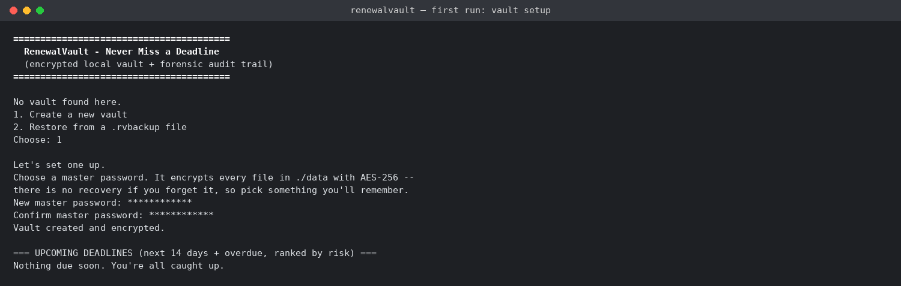
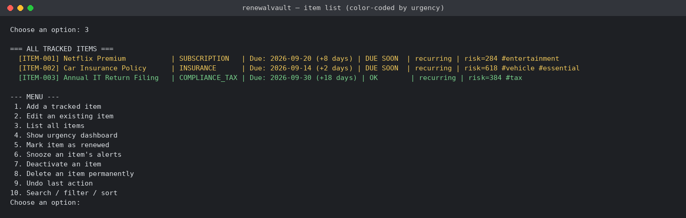
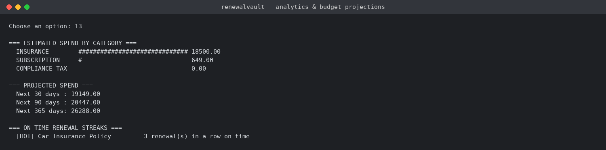
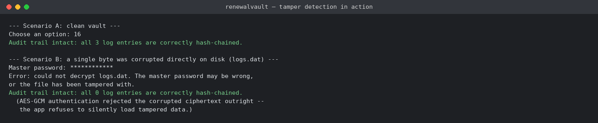

# RenewalVault — One Encrypted Platform for Every Deadline in Your Life

*Submitted for: **Programming in Java** — VITyarthi, Build Your Own Project*

RenewalVault is a command-line Java application that tracks every kind of
recurring or one-time deadline a person deals with — subscriptions,
insurance, warranties, licenses/IDs, domain names, vehicle servicing,
health checkups, perishable groceries, tax/compliance filings, and
pet/plant care — all in a single unified platform, instead of scattering
them across separate apps or forgetting them entirely.

Unlike a typical student CLI project, RenewalVault is built as an
**encrypted vault with a forensic-grade audit trail**, not just a list
with dates: every save is AES-256 encrypted behind a master password, a
weighted risk engine ranks what actually needs your attention first, and
every action is recorded in a SHA-256 hash-chained log so tampering with
your own history can be detected — the same tamper-evidence principle
used in digital chain-of-custody, applied to an everyday productivity
tool.

## What makes this stand out

| Area | What a typical version does | What RenewalVault does |
|---|---|---|
| Storage | Plain serialized file, readable by anyone with disk access | **AES-256-GCM encrypted**, password-derived key (PBKDF2, 120k iterations), authenticated so any byte-level tampering is detected on load |
| Password changes | Not supported, or means losing your data | **Live master-password rotation** — re-encrypts the entire vault in place, verified by an automated test |
| Ordering | Sort by raw due date | **Weighted risk score** — days remaining × category stakes (a lapsed insurance policy outranks a $0 subscription due one day sooner) + cost |
| History | Plain append-only log | **SHA-256 hash-chained** audit trail — like a mini blockchain / Git commit chain, `verifyAuditIntegrity()` proves whether history was edited outside the app |
| Getting reminded | Only inside the CLI | **`.ics` calendar export** — import your due dates straight into Google Calendar / Outlook / Apple Calendar |
| Data portability | None | **CSV backup/restore** for spreadsheets, and a **single-file encrypted `.rvbackup`** for moving the whole vault to another machine |
| Mistakes | Permanent | **Single-step undo** for add/edit/renew/deactivate/delete |
| Editing | Delete and re-add | **Full edit flow** — change any field on an existing item without losing its ID or history |
| Habits | No feedback loop | **On-time renewal streaks** per item, tracked from the audit log itself |
| Insight | A flat list | **Analytics module**: ASCII bar charts of spend/count by category, 30/90/365-day cost projections |
| Findability | Scroll and read | **Search by name/tag, filter by category/overdue/due-window, sort 5 ways** |
| UX | Plain text | **Color-coded urgency** (red=overdue, yellow=due soon, cyan=snoozed, green=fine) |
| Correctness | "We tested it manually" | **12-case automated regression suite**, zero dependencies, runnable with one command |

## Features

- **Master-password-locked vault**: AES-256-GCM encryption of every data
  file, with PBKDF2 key derivation and a constant-time password check —
  a stolen `data/` folder is useless without the password
- **Master password rotation**: change your password at any time; the
  vault is re-encrypted in place and reloaded to confirm the rotation
  actually worked
- **Add and edit items** across 11 life categories (subscriptions,
  insurance, warranties, licenses, domains, vehicles, health,
  groceries, compliance/tax, pet & plant care, other), with optional
  tags and a per-item custom alert window; editing lets you change any
  field on an existing item without losing its ID or history, and a
  duplicate-name check warns before you accidentally track the same
  thing twice
- **Flexible recurrence**: one-time, weekly, monthly, yearly, or a
  custom day interval
- **Weighted urgency dashboard**: a priority queue surfaces what's
  overdue or due soon first, ranked by a risk score that combines
  urgency, category stakes, and cost — not just a flat list by date
- **Snooze**: suppress an item's alerts until a chosen date without
  touching its real due date
- **Renewal tracking with on-time streaks**: mark an item as renewed
  and it automatically rolls forward to its next due date; each
  renewal is tagged on-time or late, and a running per-item streak of
  consecutive on-time renewals is tracked from the audit log itself
- **Search / filter / sort**: by name, tag, category, overdue-only, or
  due-within-N-days, sorted by risk, date, name, cost, or category
- **Tamper-evident reminder history**: every alert, renewal, snooze, add,
  and edit is hash-chained, and `verifyAuditIntegrity()` will tell you
  exactly where the chain breaks if anything was altered outside the app
- **Single-step undo** for the most recent add/edit/renew/deactivate/delete
- **Analytics**: ASCII bar charts of item count and estimated cost per
  category, 30/90/365-day spend projections, and on-time renewal streaks
- **CSV backup/restore**: export everything to a spreadsheet-friendly
  file and re-import it later (or on a different machine) — flagged in
  the CLI as plain text, since it's meant to be human-editable
- **Full encrypted backup/restore**: bundle the entire encrypted vault
  (still AES-256, byte-for-byte) into a single portable `.rvbackup`
  file, and restore it onto any machine with the original password —
  useful for moving machines or recovering from a wiped `data/` folder
- **Calendar export**: generate a standards-compliant `.ics` file so any
  calendar app can remind you too, without RenewalVault ever talking to
  a third-party API
- **Category overview**: a single-screen breakdown of everything you're
  tracking across every domain
- **Persistent, encrypted storage**: all data is saved locally and
  reloaded automatically next run — no internet or external database
  required
- **Automated regression suite**: 12 zero-dependency test cases covering
  encryption, tamper detection, recurrence math, risk scoring, CSV
  round-tripping, undo, backup/restore, and password rotation — runnable
  with a single command (see Testing below)

## Technologies Used

- Java 21 (core language + `javax.crypto` only — no external libraries)
- Object-oriented design (`model`, `engine`, `db`, `cli`, `security` packages)
- `java.util` (`PriorityQueue`, `Map`, `List`, streams) for the urgency
  and analytics engines
- `javax.crypto` (AES/GCM, PBKDF2, HMAC-SHA256) for the encrypted vault
  and password verification — part of every standard JDK, so the
  project's "no external dependency" promise is untouched
- `java.security.MessageDigest` (SHA-256) for the hash-chained audit log
- `java.io` object serialization (now encrypted before being written) as
  the storage layer in place of an external database
- `java.time` for date/recurrence handling

## Prerequisites

- **JDK 17 or later** installed and on your `PATH`
  (developed and tested on JDK 21)
- Check your version:
  ```
  java -version
  javac -version
  ```

## How to Build and Run

No build tool, no external dependencies, no internet connection
required — just `javac` and `java`.

### 1. Get the code

```bash
git clone https://github.com/<your-username>/<your-repo-name>.git
cd <your-repo-name>
```

### 2. Compile

From the project root:

```bash
find src -name "*.java" > sources.txt
javac -d out @sources.txt
```

(On Windows, `find` isn't available — instead run:
`javac -d out $(Get-ChildItem -Recurse -Filter *.java -Path src | % FullName)`
in PowerShell, or simply list the files manually.)

### 3. Run

```bash
java -cp out renewalvault.cli.Main
```

**First run**: you'll be asked to set a master password. This encrypts
every file in `./data` with AES-256 — there is no recovery mechanism if
you forget it, by design (that's what makes it real encryption and not
security theater).

**Every run after that**: enter the same master password to unlock the
vault. You get 3 attempts before the app exits.

Once unlocked, follow the on-screen menu to add items, view the urgency
dashboard, renew or snooze things, search/filter, check analytics,
export to CSV/calendar, or verify the audit trail's integrity.

### 4. Data storage

All data is stored **encrypted** in a `data/` folder (created
automatically in your current working directory): `items.dat`,
`logs.dat`, and `vault.meta` (salt + password verifier only — never the
password itself). Deleting the `data/` folder resets the app to a fresh
state and you'll be asked to set a new master password.

## Testing

RenewalVault ships with a **zero-dependency automated regression
suite** — no JUnit, Maven, or Gradle required, just `javac`/`java`,
consistent with the rest of the project.

Run it with:

```bash
java -cp out renewalvault.test.TestRunner
```

It exercises, against a disposable temp directory (never your real
`./data`):

- AES-256-GCM encrypt/decrypt round-tripping
- Correct-password unlock and wrong-password rejection
- That encrypted files on disk contain no readable plaintext
- Risk-score ordering (overdue and high-stakes categories outrank
  low-stakes ones due sooner)
- Recurrence roll-forward math for all 5 recurrence types
- Hash-chain integrity: a valid chain verifies clean, and a spliced-in
  tampered entry is caught at the exact position it occurs
- CSV export/import round-tripping, including names with embedded
  commas and quotes
- Undo correctly reversing both an add and a delete
- Full encrypted backup/restore preserving the vault's password and data
- Duplicate item name detection
- On-time renewal streak tracking (increments on time, resets on late)
- Master password rotation, confirming the old password stops working
  and the new one correctly decrypts the re-encrypted data

All 12 cases were passing at time of submission (`12 passed, 0 failed`).

Beyond the automated suite, the application was also manually tested
end-to-end via the actual CLI, including:
- Adding, editing, and renewing items across multiple categories with
  different recurrence types, tags, and custom alert windows, and
  confirming malformed input (bad dates, non-numeric input) is caught
  and reported without crashing
- Restarting the application and confirming all previously added items,
  their due dates, and full reminder history persist correctly across
  runs **while encrypted at rest**
- Changing the master password mid-session and confirming the old
  password is rejected on the next run while the new one unlocks the
  vault with all data intact
- Exporting a full encrypted backup and restoring it into a brand-new,
  empty directory on what is effectively a fresh machine, confirming
  the same password and the same data come back
- Deliberately corrupting an encrypted log file on disk and confirming
  the app detects the tampering (AES-GCM authentication failure) instead
  of silently loading corrupted data
- Exporting to CSV and re-importing it, and exporting to `.ics` and
  confirming the file is well-formed iCalendar

## Screenshots

| | |
|---|---|
|  |  |
|  |  |

## Design Diagrams

Full-size diagrams live in [`docs/diagrams/`](docs/diagrams/) and are also embedded in
`PROJECT_REPORT.pdf`:

- [System Architecture](docs/diagrams/01_system_architecture.png)
- [Process Flow / Workflow](docs/diagrams/02_workflow.png)
- [Use Case Diagram](docs/diagrams/03_use_case.png)
- [Class Diagram](docs/diagrams/04_class_diagram.png)
- [Data Model / Schema Diagram](docs/diagrams/05_data_model.png)
- [Sequence Diagram — Add Item](docs/diagrams/06_sequence_add_item.png)
- [Sequence Diagram — Vault Unlock](docs/diagrams/07_sequence_unlock.png)

## Project Structure

```
src/main/java/renewalvault/
├── model/
│   ├── TrackedItem.java      # A single deadline/renewal item + weighted risk score
│   └── ReminderLog.java      # Hash-chained, tamper-evident audit log entry
├── engine/
│   ├── VaultService.java     # Module 1: item management, search/filter/sort, undo, edit
│   ├── ReminderEngine.java   # Module 2: risk-weighted urgency engine, audit chain, streaks
│   ├── AnalyticsEngine.java  # Module 5: budget analytics & ASCII charts
│   ├── ExportEngine.java     # Module 6: CSV backup/restore + .ics calendar export
│   └── BackupEngine.java     # Module 7: single-file encrypted vault backup/restore
├── security/
│   ├── CryptoUtil.java       # AES-256-GCM + PBKDF2 (no external crypto library)
│   └── VaultAuth.java        # Master-password setup/unlock/rotation, salt + verifier storage
├── db/
│   └── FileStore.java        # Module 3: generic encrypted file-based persistence
├── cli/
│   ├── Main.java              # Module 4: CLI menu, login flow, and reporting
│   └── ConsoleColors.java     # ANSI color helper for the urgency dashboard
└── test/
    └── TestRunner.java        # Zero-dependency automated regression suite (see Testing)

docs/
├── diagrams/     # Architecture, workflow, use case, class, ER, and sequence diagrams
└── screenshots/  # Terminal screenshots referenced above

PROJECT_REPORT.pdf   # Full 15-section project report (see submission requirements)
build_report.py      # Regenerates PROJECT_REPORT.pdf from the diagrams/screenshots (requires
                      # reportlab + Pillow; not needed to build or run the application itself)
```

See `IMPROVEMENTS.md` for a detailed before/after of what was added on
top of the original scope and why.

## Author

Mushkan — B.Tech CSE (Cyber Security & Digital Forensics), VIT Bhopal University

Submitted for: **Programming in Java** (VITyarthi — Build Your Own Project)
